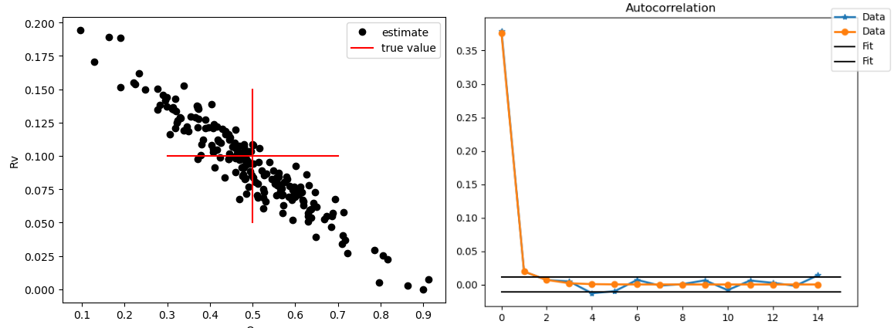

# Python Autocovariance Least-Squares (ALS) Module

When working with noisy data coming from complex processes it can be helpful to apply Kalman filters, and use repeated measurements to estimate the level of noise and to improve the estimate of the underlying process that generated the data. 

But for the initial setting up of the filter it is necessary to make statements to the level of noise in the various channels, and the covariance between them.

The [autocovariance least-squares method](https://minds.wisconsin.edu/bitstream/handle/1793/10890/file_1.pdf) has been shown to be effective at off-line noise covariance estimation. This module is a Python translation of the [ALS Package, Release 5.0](https://github.com/AaronWebster/als) written in Octave. The latest release can be found on the [Rawlings Group](https://sites.engineering.ucsb.edu/~jbraw/software/als/download/index.html) website.

The initial translation was performed using [SMOP](https://github.com/victorlei/smop) and then refined by hand. All basic functions and most tests have been verified to be correct, but the re-implementation of the `ltv_als` function has been skipped, as I was unable to translate some of the underlying functions. For further details see [the corresponding file](./src_files/not_translated/case1_als.py).

When I first translated this package, some of the tests revealed severe and quite opaque issues with some of the matrices when the installed [NumPy](https://numpy.org/) library was compiled with MKL, as was (and still is) the default. It was not entirely clear what the underlying cause was, but could be resolved by using NumPy compiled with OpenBLAS. For more information check out the docstrings in [als_utils.py](./als_utils.py). Now, around one year (mid-2025) later, this issue appears to be resolved, as the default installations do not crash. The comments are still included in case I am mistaken.

A currently working Anaconda/Mamba [environment.yml](environment.yml) is included in this repository.

As all function have been reimplemented using [Numba](https://numba.pydata.org/), speed should be at the same level as the original Octave package, and is actually a bit higher for some of the functions.

You can find some translated examples in [this Jupyter notebook](PythonALSExample.ipynb). There are also a small number of tests (timing and the aforementioned NumPy issue) in [another notebook](PythonALSTests.ipynb).